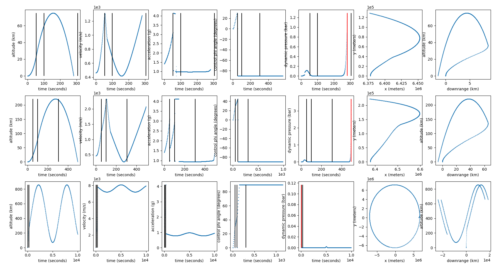

# :rocket: :rocket: :rocket: Rocket Control :rocket: :rocket: :rocket:

Do you like [flightclub.io](flightclub.io) but want more control? Do you want to design weird hot-staging and/or turbo-staging fully reusable rockets? Do you want to use control theory to optimize your trajectories? 

Rocket Control is a simple orbital rocket trajectory simulator, loosely based on flightclub.io  The primary purpose is to see what kind of weird Kerbal-esque improvements we can make starting with the SpaceX Starship architecture. This is a side project and a work in progress.

